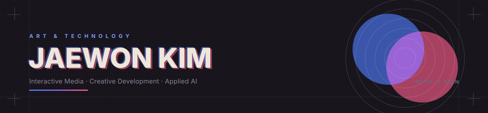
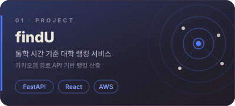
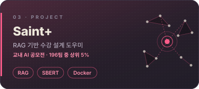
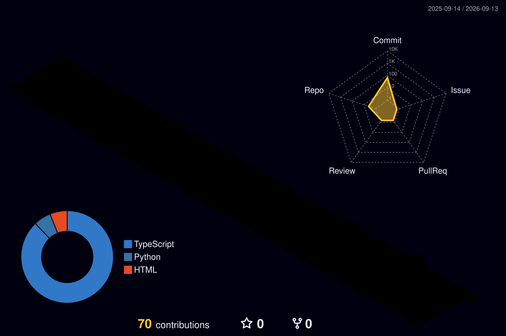

<picture>
  <source media="(prefers-color-scheme: dark)" srcset="assets/banner-dark.svg">
  <source media="(prefers-color-scheme: light)" srcset="assets/banner-light.svg">
  
</picture>

보이지 않던 것에 형태를 준다. 기술은 그 형태를 지탱하는 재료다.

<!--START_SECTION:waka-->
<!--END_SECTION:waka-->

